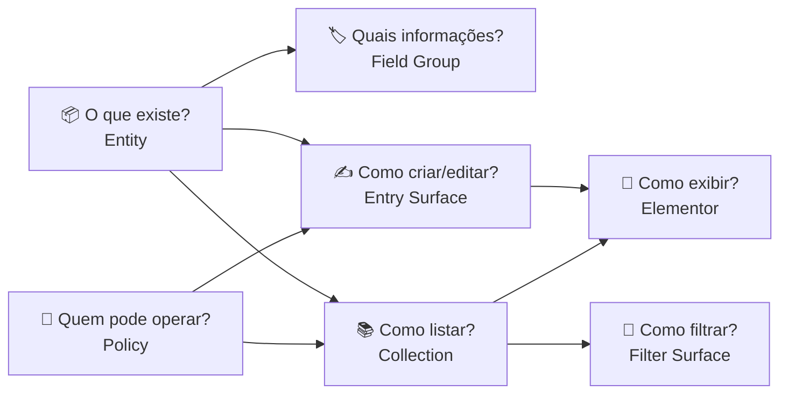
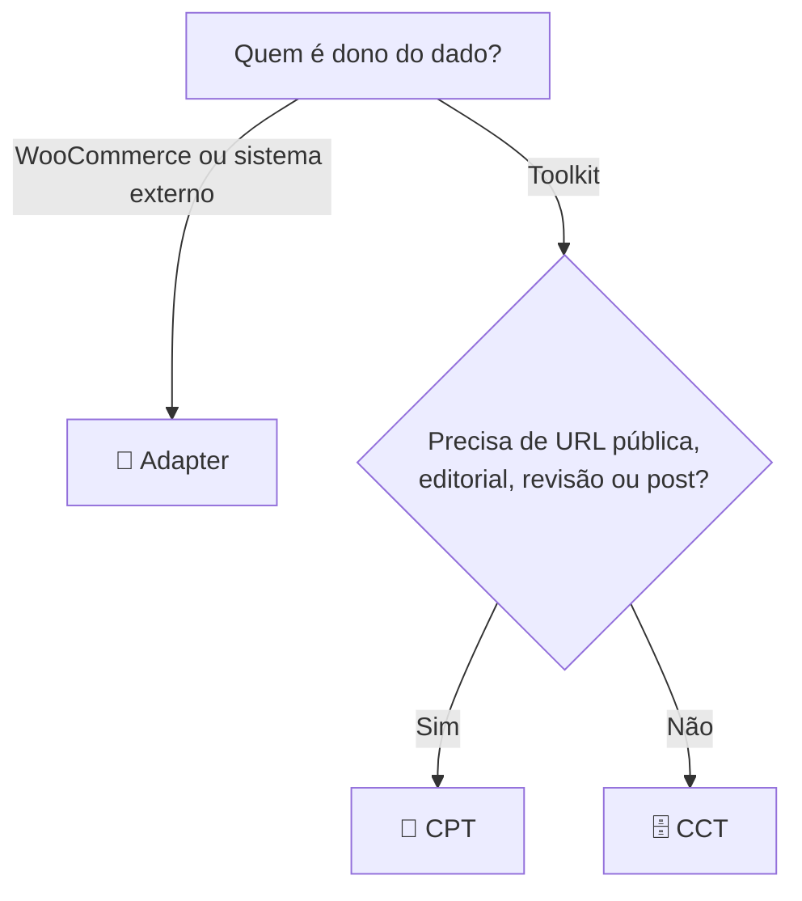
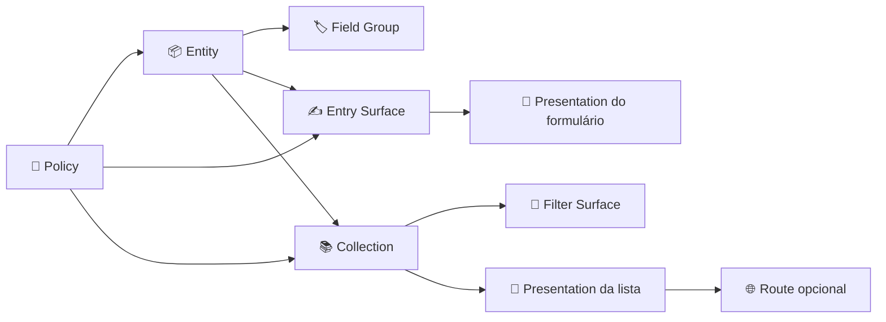
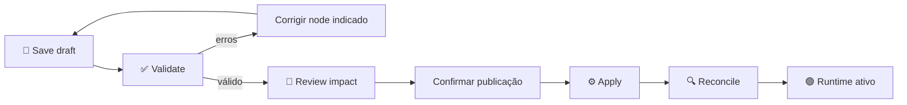
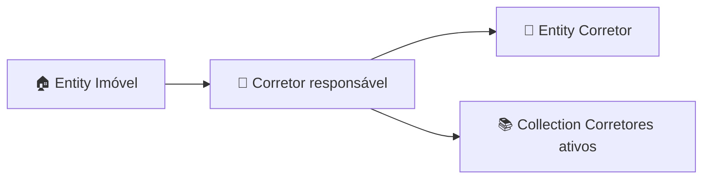

[Visão geral](../readme.md)

# Elementor Implementation Toolkit

> 🦸 Um compilador de sistemas estruturados para WordPress e Elementor.
>
> Você descreve **o que existe**, **como é editado**, **como é consultado** e
> **quem pode fazer o quê**. O Toolkit transforma esse mapa em CPTs, CCTs,
> formulários, consultas, filtros, contratos Elementor e políticas executáveis.

**Versão atual:** `1.0.0-rc.1` — build interno de dogfood

**Requisitos:** WordPress 6.7+, PHP 8.1+, Elementor Free para os widgets conectores

**Idioma deste manual:** PT-BR

> [!IMPORTANT]
> O percurso recomendado nesta build é **criar sistemas novos do zero**.
> Importação, comparação e migração de estruturas legacy existem para
> diagnóstico e evolução interna, mas devem ser tratadas como experimentais.
> Não baseie uma troca de runtime de produção nelas.

---

## Navegação rápida

- [A ideia em 90 segundos](#a-ideia-em-90-segundos)
- [Começando: CPT, CCT ou Adapter?](#começando-cpt-cct-ou-adapter)
- [O que cada parte da interface faz](#o-que-cada-parte-da-interface-faz)
- [Dicionário completo dos nodes](#dicionário-completo-dos-nodes)
- [Gramática das conexões](#gramática-das-conexões)
- [Campos e capacidades](#campos-e-capacidades)
- [Tutorial completo: sistema Clientes](#tutorial-completo-sistema-clientes)
- [Como publicar sem alterar tudo por acidente](#como-publicar-sem-alterar-tudo-por-acidente)
- [Elementor: widgets, templates e Dynamic Tags](#elementor-widgets-templates-e-dynamic-tags)
- [Formulários e workflows](#formulários-e-workflows)
- [Collections e filtros](#collections-e-filtros)
- [Relações entre entidades](#relações-entre-entidades)
- [Presentations e Routes](#presentations-e-routes)
- [Receitas para diferentes projetos](#receitas-para-diferentes-projetos)
- [Diagnóstico e solução de problemas](#diagnóstico-e-solução-de-problemas)
- [Limites intencionais](#limites-intencionais)
- [Instalação e desenvolvimento](#instalação-e-desenvolvimento)
- [Arquitetura para extensões](#arquitetura-para-extensões)
- [Glossário](#glossário)

---

## A ideia em 90 segundos

Um **System** é o projeto executável de uma pequena aplicação dentro do
WordPress.

Exemplos:

- `Clientes`;
- `Imóveis`;
- `Profissionais e especialidades`;
- `Cardápio`;
- `Vagas`;
- `Eventos`;
- `Projetos do portfólio`;
- `Chamados de suporte`.

Dentro do System, cada cartão do mapa é um **node**. Os nodes descrevem quatro
perguntas:

| Lane | Pergunta humana | Exemplos |
| --- | --- | --- |
| 📦 Data | O que existe e quais dados possui? | Entity, Field Group, Relation |
| 🧭 Experience | Como alguém cria, encontra ou filtra isso? | Entry Surface, Collection, Filter Surface |
| 🎨 Presentation | Como isso aparece e em qual URL? | Presentation, Route |
| 🔐 Governance | Quem manda e quem pode acessar? | Policy, Adapter |

O fluxo mental mais simples é:



O Toolkit não é um page builder. Ele divide responsabilidades assim:

- **Toolkit:** dados, contratos, consulta, filtros, workflow, autorização e
  diagnóstico;
- **Elementor:** layout, estilo, responsividade e composição visual;
- **WooCommerce:** preço transacional, estoque, carrinho, pedido, checkout e
  pagamento;
- **WordPress:** posts, usuários, taxonomias, mídia e capacidades.

### O que significa “compilar”

Compilar não é gerar PHP para você editar. É transformar o mapa em contratos
imutáveis que o runtime consegue executar:

```text
Blueprint visual
    ↓
validação das conexões e decisões
    ↓
recomendação de storage
    ↓
Field Contracts por UUID
    ↓
CPT/CCT/Adapter + formulários + Collections + filtros
    ↓
widgets e contexto do Elementor
```

O **Field ID** é a identidade estável de um campo. O nome visível pode mudar de
“Telefone” para “WhatsApp”, mas widgets e formulários continuam ligados ao mesmo
UUID. O fluxo normal não pede meta key, SQL, PHP ou seletor CSS.

---

## Começando: CPT, CCT ou Adapter?

Você normalmente não precisa escolher manualmente. Configure a Entity e o
Toolkit apresenta uma recomendação explicada.



### 📝 Use CPT quando

- o conteúdo precisa de URL, archive ou single;
- haverá publicação editorial;
- você quer revisões do WordPress;
- o modo da Entity é `Editorial` ou `Hybrid`;
- plugins e APIs precisam reconhecer aquilo como post;
- o conteúdo é público e participa da semântica normal do WordPress.

Exemplos: imóveis públicos, profissionais, artigos estruturados, projetos de
portfólio, cursos e eventos.

### 🗄️ Use CCT quando

- são registros estruturados sem página própria;
- o volume ou a consulta indexada importam;
- são dados operacionais;
- o editor visual do WordPress não é necessário;
- o acesso costuma acontecer por formulário, lista ou integração.

Exemplos: leads, clientes internos, horários, unidades de disponibilidade,
linhas de comparação e registros auxiliares.

### 🔌 Use Adapter quando

- o dado pertence ao WooCommerce;
- outra plataforma é a fonte de verdade;
- o Toolkit só deve expor capacidades permitidas pelo adapter.

Exemplos: produtos WooCommerce ou registros de uma futura API externa.

### Override avançado

É possível contrariar a recomendação, mas o Toolkit exige um motivo. Isso evita
escolher CCT para conteúdo que depois precisará de URL e revisões, ou escolher
CPT para milhões de registros operacionais sem semântica de post.

---

## O que cada parte da interface faz

### Menu do WordPress

| Tela | Função |
| --- | --- |
| **Systems** | Criar, conectar, validar e publicar Blueprints |
| **Runs** | Ver execuções reais, falhas e tentativas |
| **Diagnostics** | Conferir schema e saúde dos adapters registrados |
| **Settings** | Ver limites do produto e acessar superfícies legacy de recuperação |

As antigas telas de Post Types, Content Types e Filter Presets não são o centro
do produto. Elas permanecem como compatibilidade e recuperação durante a série
1.x.

### Barra superior de um System

#### `Save draft`

Salva o mapa atual como rascunho.

- não registra CPT;
- não cria tabela CCT;
- não muda a página publicada;
- não altera o runtime.

Use para não perder o trabalho enquanto o System ainda está incompleto.

#### `Validate`

Pergunta ao servidor: “este mapa forma um sistema executável?”

Valida, entre outras coisas:

- conexões compatíveis e na direção correta;
- nodes órfãos;
- obrigatoriedade de Entity, Policy ou Collection;
- IDs e referências de campos;
- capabilities de busca, filtro e ordenação;
- colisões de slug, storage e Route;
- workflow e ações;
- saúde dos adapters envolvidos.

Validação aprovada **não publica**. Ela apenas prova que a configuração salva é
coerente.

#### `Review impact`

Salva, valida e prepara um plano do que mudaria:

- definições;
- storage;
- campos;
- índices;
- Collections;
- formulários;
- rotas;
- bindings Elementor;
- políticas.

É a etapa para ler antes de confirmar. Alterações no mapa nunca mudam o runtime
imediatamente.

### Map e Outline

- **Map:** visão espacial; posições servem apenas para leitura;
- **Outline:** lista equivalente para teclado, leitor de tela e inspeção rápida.

Mover um node no canvas não muda o checksum semântico do Blueprint.

### Inspector lateral

As seis seções significam:

1. **What this node does:** responsabilidade do node;
2. **Where it enters the flow:** conexões existentes;
3. **Compiled effect:** contrato que será gerado;
4. **Who can access:** exposição e política;
5. **Essential decisions:** opções realmente editáveis;
6. **Technical details:** IDs, storage e diagnóstico avançado.

Traduções importantes:

- **runtime data:** o registro real usado durante uma renderização;
- **compiled effect:** o contrato interno que nascerá da publicação;
- **semantic fallback:** HTML seguro do Toolkit quando nenhum template Elementor
  foi selecionado;
- **not connected:** o node ainda não participa do sistema e a validação deve
  bloqueá-lo.

---

## Dicionário completo dos nodes

### 📦 Entity — “que tipo de coisa existe?”

Representa um tipo de conteúdo ou registro, não um item individual.

Exemplos:

- Entity `Cliente` → itens João, Maria, Empresa ACME;
- Entity `Imóvel` → itens Casa 101, Apartamento Centro;
- Entity `Profissional` → itens Dra. Ana, Dr. Paulo.

Decisões principais:

- **Structured:** somente campos estruturados; padrão;
- **Editorial:** conteúdo editorial intencional;
- **Hybrid:** editor WordPress mais campos estruturados;
- **Public content:** pode participar de exposição pública;
- **Has a public route:** precisa de URL;
- **Keep revisions:** usa semântica de revisões.

Saída compilada: definição CPT, CCT ou contrato de Adapter.

Conexões frequentes:

- Entity → Field Group;
- Entity → Entry Surface;
- Entity → Collection;
- Entity → Presentation;
- Policy → Entity;
- Adapter → Entity.

### 🏷️ Field Group — “quais informações essa coisa possui?”

Agrupa Field Contracts pertencentes a uma Entity.

Cada Field declara:

- nome público;
- tipo semântico;
- obrigatoriedade e validação;
- exposição;
- storage;
- busca, filtro e sort;
- componentes de formulário;
- categorias compatíveis no Elementor.

Uma Entity pode ter mais de um grupo, por exemplo:

- `Dados principais`;
- `Contato`;
- `Mídia`;
- `SEO`;
- `Informações comerciais`.

Todo Field Group precisa pertencer a exatamente uma Entity.

### 🔗 Relation — “como registros diferentes se relacionam?”

Cria uma relação normalizada entre duas Entities.

Cardinalidades:

- `one_to_one`;
- `one_to_many`;
- `many_to_one`;
- `many_to_many`.

Uma Relation precisa de:

1. uma Entity de origem;
2. uma Entity de destino;
3. uma Collection da Entity de destino para fornecer opções autorizadas.

Exemplo:

```text
Imóvel ──origem──▶ Relação "Corretor responsável" ──destino──▶ Corretor
                                │
                                └──opções──▶ Collection "Corretores ativos"
```

### ✍️ Entry Surface — “como alguém cria ou edita?”

Define comportamento de formulário e workflow.

Pode controlar:

- criação e atualização;
- status inicial;
- autosave;
- campo usado como título;
- passos;
- condições;
- repeaters;
- campos calculados;
- redirect;
- e-mail;
- webhook;
- entrada moderada de visitantes.

Não define o visual final. No Elementor, use o widget **Toolkit Entry Surface**
para posicionar e estilizar o formulário publicado.

Requisitos:

- exatamente uma Entity conectada;
- exatamente uma Policy conectada.

### 📚 Collection — “qual conjunto de registros quero consultar?”

É a autoridade única de consulta do Toolkit.

Exemplos:

- todos os imóveis publicados;
- clientes do usuário atual;
- profissionais de uma especialidade;
- produtos WooCommerce disponíveis;
- próximos eventos.

Configura:

- público ou autenticado;
- itens por página;
- ordenação padrão;
- cache;
- diagnóstico Explain Why.

Uma Collection precisa pertencer a exatamente uma Entity.

### 🔎 Filter Surface — “como o usuário reduz uma Collection?”

Deriva filtros dos Fields conectados à Entity da Collection.

Ela não inventa operadores. Um Field de preço oferece operações numéricas; uma
taxonomia oferece escolhas; um booleano oferece estado verdadeiro/falso.

Pode controlar:

- Fields disponíveis;
- facets e contagens;
- estado na URL;
- chips de filtros ativos;
- aplicação automática ou por botão.

Uma Filter Surface precisa pertencer a exatamente uma Collection.

Se nada aparece no inspector, confira:

1. Filter Surface conectada à Collection;
2. Collection conectada à Entity;
3. Field Group conectado à Entity;
4. Field com `Filter` habilitado;
5. primitiva compatível com filtro.

### 🎨 Presentation — “qual contrato visual recebe os dados?”

Liga um contexto executável a um adapter de apresentação.

Pode receber:

- Entity → Presentation, para contexto de item;
- Entry Surface → Presentation, para formulário;
- Collection → Presentation, para lista;
- Presentation → Presentation, para composição avançada.

O adapter disponível é Elementor. Você pode escolher um documento/template
Elementor existente ou usar o fallback semântico.

Uma Presentation **não é** o template. Ela é o vínculo estável entre dados,
contexto e template.

### 🌐 Route — “em qual caminho público isso responde?”

Expõe uma Presentation em uma URL intencional.

Exemplos:

- `/imoveis`;
- `/equipe`;
- `/agenda`;
- uma rota parametrizada avançada como
  `/imovel/{UUID-DO-FIELD-PUBLICO}`.

Uma Route precisa pertencer a exatamente uma Presentation.

Não adicione Route quando o conteúdo será usado apenas dentro de uma página já
existente do Elementor.

### 🔐 Policy — “quem pode ver, criar ou editar?”

Aplica:

- capability do WordPress;
- capability de publicação;
- ownership;
- escopo do objeto.

Pode governar Entity, Entry Surface e Collection.

Exemplos:

- editor administra qualquer imóvel;
- corretor edita apenas imóveis próprios;
- visitante somente consulta Collection pública;
- cliente autenticado atualiza apenas seu próprio perfil.

IDs enviados pelo navegador nunca substituem a autorização do servidor.

### 🔌 Adapter — “qual sistema externo continua sendo dono?”

Usado quando os dados não pertencem ao storage nativo do Toolkit.

Exemplo principal: WooCommerce.

O Adapter declara capacidades e saúde. Se WooCommerce estiver ausente, o
contrato aparece como indisponível; o Toolkit não simula preço ou estoque.

Um Adapter conecta-se a exatamente uma Entity.

---

## Gramática das conexões

A direção importa. Arraste do node da coluna **Origem** para o node da coluna
**Destino**.

| Origem | Destino | Significado | Obrigatoriedade |
| --- | --- | --- | --- |
| Entity | Field Group | a Entity possui estes campos | todo Field Group precisa de 1 |
| Entity | Relation | Entity de origem da relação | toda Relation precisa de 1 |
| Relation | Entity | Entity de destino | toda Relation precisa de 1 |
| Relation | Collection | fonte autorizada de opções | toda Relation precisa de 1 |
| Entity | Entry Surface | formulário cria/edita esta Entity | toda Entry Surface precisa de 1 |
| Entity | Collection | consulta registros desta Entity | toda Collection precisa de 1 |
| Collection | Filter Surface | filtros controlam esta Collection | toda Filter Surface precisa de 1 |
| Entity | Presentation | apresenta um item/contexto | opcional |
| Entry Surface | Presentation | apresenta um formulário | opcional |
| Collection | Presentation | apresenta uma lista | opcional |
| Presentation | Presentation | compõe apresentações | avançado |
| Presentation | Route | expõe a Presentation em uma URL | toda Route precisa de 1 |
| Policy | Entity | governa a Entity | conforme o acesso |
| Policy | Entry Surface | governa criação/edição | obrigatória |
| Policy | Collection | governa consulta | recomendada para acesso autenticado |
| Adapter | Entity | Adapter é dono do storage | exatamente 1 por Adapter |

Visão de um sistema completo:



> [!TIP]
> Um node solto pode ser salvo em draft, mas não pode ser publicado. Isso
> permite construir o sistema aos poucos sem criar runtime incompleto.

---

## Campos e capacidades

### Capacidade da primitiva × decisão do Field

Para um Field aparecer em busca, filtros ou ordenação, duas coisas precisam ser
verdadeiras:

1. a primitiva suporta a capacidade;
2. a capacidade foi habilitada no Field.

| Família | Primitivas | Busca | Filtro | Sort |
| --- | --- | :---: | :---: | :---: |
| Texto | `short_text` | ✅ | ✅ | ✅ |
| Texto longo | `long_text`, `rich_text` | ✅ | — | — |
| Número | `integer`, `decimal`, `money`, `percentage` | ✅ | ✅ | ✅ |
| Calculado | `calculated` | — | ✅ | ✅ |
| Estado | `boolean` | ✅ | ✅ | ✅ |
| Escolha | `single_choice` | ✅ | ✅ | ✅ |
| Múltipla escolha | `multiple_choice` | ✅ | ✅ | — |
| Data e hora | `date`, `time`, `datetime`, `schedule`, `availability` | ✅ | ✅ | ✅ |
| Mídia | `image`, `gallery`, `file` | — | — | — |
| Contato | `email`, `phone`, `url` | ✅ | ✅ | ✅ |
| Visual | `color` | — | ✅ | ✅ |
| Localização | `address` | ✅ | ✅ | — |
| Coordenada | `geopoint` | ✅ | ✅ | ✅ |
| Classificação | `taxonomy` | ✅ | ✅ | ✅ |
| Ligação | `relation` | ✅ | ✅ | — |
| Estrutura filha | `repeatable_group` | — | — | — |

### Exposição

- Field privado não deve aparecer em resposta pública;
- Collection pública projeta somente Fields explicitamente públicos;
- marcar como filtrável não torna automaticamente o valor público;
- formulários autenticados continuam sujeitos à Policy.

### Required e o valor `0`

Required rejeita ausência real, não valores falsy válidos. O número `0` e a
string `"0"` são valores válidos quando compatíveis com a primitiva.

### Campos calculados

A DSL aceita apenas:

- números;
- UUIDs de Fields entre `{}`;
- `+`, `-`, `*`, `/`;
- parênteses.

Exemplo conceitual:

```text
({UUID-QUANTIDADE} * {UUID-PRECO}) - {UUID-DESCONTO}
```

Não existe `eval`, PHP, SQL ou chamadas arbitrárias.

---

## Tutorial completo: sistema Clientes

Objetivo:

- guardar clientes internos;
- criar e editar pelo frontend;
- listar somente para usuários autorizados;
- filtrar por status;
- ordenar por último contato;
- montar a interface no Elementor.

### 1. Crie o System

Vá a:

```text
WordPress → Implementation Toolkit → Systems
```

Crie `Clientes`.

O starter cria:

- Entity `Content`;
- Field Group `Content fields`;
- conexão Entity → Field Group.

Renomeie:

- Entity para `Cliente`;
- Field Group para `Dados do cliente`.

### 2. Configure a Entity

Para um cadastro interno:

| Decisão | Valor |
| --- | --- |
| Content mode | `Structured` |
| Public content | desligado |
| Has a public route | desligado |
| Keep revisions | conforme necessidade |

Sem URL/editorial, a recomendação normal é **CCT**.

Se cada cliente precisar de perfil público e permalink, ligue `Public content`
e `Has a public route`; a recomendação passa a ser **CPT**.

### 3. Configure os Fields

No Field Group, crie:

| Nome | Tipo | Required | Search | Filter | Sort | Público |
| --- | --- | :---: | :---: | :---: | :---: | :---: |
| Nome | `short_text` | ✅ | ✅ | ✅ | ✅ | — |
| E-mail | `email` | ✅ | ✅ | ✅ | ✅ | — |
| Telefone | `phone` | — | ✅ | — | — | — |
| Status | `single_choice` | ✅ | — | ✅ | ✅ | — |
| Último contato | `date` | — | — | ✅ | ✅ | — |
| Observações | `long_text` | — | ✅ | — | — | — |

Sugestão de opções de `Status`:

- `lead`;
- `ativo`;
- `inativo`;
- `arquivado`.

Não torne e-mail e telefone públicos apenas para fazê-los aparecer no
Elementor. Um workspace autenticado consegue usar projeções permitidas pela
Policy.

### 4. Crie a Policy

Adicione `Policy` com o nome `Operadores de clientes`.

Exemplo inicial:

| Decisão | Valor |
| --- | --- |
| Capability | `edit_posts` |
| Publish capability | `publish_posts` |
| Ownership | `own` ou conforme o projeto |
| Object scope | `entity` |

Conecte:

- Policy → Entity;
- Policy → Entry Surface;
- Policy → Collection.

### 5. Crie o formulário

Adicione `Entry Surface` com o nome `Cadastro de cliente`.

Conecte:

- Entity `Cliente` → Entry Surface;
- Policy `Operadores de clientes` → Entry Surface.

Decisões iniciais:

- Create entries: ligado;
- Update entries: ligado;
- New entry status: `draft` ou `review`;
- Autosave drafts: ligado;
- Moderated guest intake: desligado;
- Record title: Field `Nome`.

Você pode acrescentar:

- passo 1: Dados principais;
- passo 2: Contato;
- passo 3: Revisão;
- condição para mostrar Observações apenas em certos status;
- e-mail ao concluir;
- redirect para a lista.

### 6. Crie a Collection

Adicione `Collection` com o nome `Lista de clientes`.

Conecte:

- Entity `Cliente` → Collection;
- Policy → Collection.

Configure:

- Audience: Signed-in users;
- Items per page: 24;
- Default order: Último contato — descending;
- Cache repeated queries: ligado;
- Explain Why: ligado durante implementação.

### 7. Crie os filtros

Adicione `Filter Surface` com o nome `Filtros de clientes`.

Conecte:

- Collection `Lista de clientes` → Filter Surface.

Selecione:

- Nome;
- E-mail;
- Status;
- Último contato.

Para `Status`, habilite facet counts. Escolha se o filtro aplica
automaticamente ou por botão.

Se esses Fields não aparecerem, volte ao Field Group e confirme que `Filter`
está habilitado.

### 8. Salve, valide e revise



Leia o Impact Map antes de confirmar. Para este exemplo, ele deve explicar a
Entity, storage, Fields, formulário, Collection, Filter Surface e Policies que
serão ativados.

### 9. Monte no Elementor

Depois da publicação:

1. crie uma página ou template no Elementor;
2. encontre a categoria **Elementor Implementation Toolkit**;
3. adicione `Toolkit Entry Surface`;
4. selecione `Cadastro de cliente`;
5. adicione `Toolkit Collection Surface`;
6. selecione `Lista de clientes`;
7. adicione `Toolkit Filter Surface`;
8. selecione `Filtros de clientes` e a Collection correspondente;
9. use `Toolkit Field` quando existir um contexto inequívoco de item.

Fallback sem Elementor:

```text
[eit_entry_surface id="UUID-DA-ENTRY-SURFACE"]
[eit_collection id="UUID-DA-COLLECTION"]
```

Os IDs aparecem nos detalhes técnicos do contrato publicado. Não digite meta
keys no lugar deles.

---

## Como publicar sem alterar tudo por acidente

O ciclo é deliberadamente separado:

1. **draft:** trabalho editável;
2. **validate:** prova de coerência;
3. **prepare impact:** plano compilado e confirmável;
4. **confirm:** autorização explícita;
5. **apply:** criação/ativação dos artefatos;
6. **reconcile:** comparação do que deveria existir com o que foi persistido.

Versões publicadas e artefatos são imutáveis. Uma edição posterior cria outro
change set.

### Rollback

Rollback reativa uma versão anterior e preserva dados posteriores. Ele não
significa apagar silenciosamente colunas ou registros.

> [!WARNING]
> Fluxos de migração destrutiva, importação legacy e troca de autoridade ainda
> são experimentais nesta build. Para dogfood, prefira um novo System e novos
> registros. Faça backup antes de qualquer teste de migração.

### Estados que exigem atenção

- **blocked:** o plano não pode ser aplicado;
- **applying:** publicação em andamento ou aguardando recuperação;
- **reconciliation failed:** o runtime não corresponde à versão esperada;
- **rollback required:** a versão anterior deve ser reativada;
- **adapter unhealthy:** dependência externa indisponível.

Use **Runs** e **Diagnostics**; não repita cliques de publicação sem entender o
estado.

---

## Elementor: widgets, templates e Dynamic Tags

### Widgets do Elementor Free

| Widget | Uso |
| --- | --- |
| `Toolkit Field` | renderiza um Field compatível no contexto atual |
| `Toolkit Collection Surface` | renderiza os resultados de uma Collection |
| `Toolkit Filter Surface` | controla uma Collection publicada |
| `Toolkit Entry Surface` | posiciona um formulário/workspace |
| `Toolkit Action` | executa operação permitida pela Entry Surface |
| `Filter Controller` | ponte de compatibilidade com listings legacy |

Esses widgets não recriam schema, consulta ou autorização. Eles conectam
contratos publicados e oferecem controles de apresentação.

### `Toolkit Field`

Escolha:

- contexto de Entity quando o preview não consegue inferir;
- Field publicado compatível;
- elemento HTML;
- prefixo e sufixo;
- link automático para valores URL-compatible;
- estilo e alinhamento.

Imagem e galeria são renderizadas de acordo com a categoria semântica do Field.

### Collection + Filter Surface

Os dois widgets devem apontar para contratos compatíveis. A Collection é dona da
consulta; a Filter Surface é dona do comportamento de filtros; o Elementor é
dono do visual.

### Entry Surface + Action

O formulário expõe os Fields e workflow. `Toolkit Action` pode oferecer ações
como criar, atualizar, publicar, arquivar ou restaurar quando o contrato e a
Policy permitirem.

### Templates existentes

Uma Presentation pode selecionar um documento Elementor já existente.

- ler a lista não cria template;
- escolher um template não reescreve seu conteúdo;
- criação de draft, quando disponível, exige ação explícita;
- o Toolkit usa managers públicos do Elementor Core.

### Dynamic Tags do Elementor Pro

Quando Pro está disponível, o Toolkit registra tags tipadas:

- Text;
- Number;
- URL;
- Image;
- Gallery;
- Color.

Todas usam o mesmo `TypedValueResolver` e exibem somente Fields compatíveis com
o contexto. Não digite meta keys.

### Contexto

Um Field só produz valor quando existe contexto de item:

- post atual de uma Entity CPT;
- registro atual de uma Collection;
- contexto de Route;
- item projetado pelo adapter;
- seleção explícita de Entity quando o editor não consegue inferir.

Se `Toolkit Field` estiver vazio no editor, não conclua que o dado sumiu.
Primeiro verifique o contexto do preview.

---

## Formulários e workflows

### Operações

Uma Entry Surface pode permitir, conforme storage e Policy:

- create;
- update;
- draft;
- review;
- publish;
- archive;
- restore.

O servidor autoriza cada operação. Um `item_id` enviado pelo navegador não
concede ownership.

### Status inicial

- `draft`: adequado para autosave e preenchimento incompleto;
- `review`: adequado para moderação;
- `publish`: use somente quando a Policy e o processo realmente permitirem.

### Passos

Passos organizam Fields sem duplicar contratos.

Exemplo:

```text
1. Identificação
2. Endereço
3. Mídia
4. Revisão e envio
```

### Condições

Condições controlam visibilidade e comportamento a partir de Field IDs.

Exemplos:

- mostrar “Dados da empresa” se Tipo = Empresa;
- mostrar “Motivo do arquivamento” se Status = Arquivado;
- mostrar “Galeria” somente se Tipo de imóvel = Casa.

### Repeaters

`repeatable_group` grava estruturas filhas normalizadas, não uma string
serializada usada como query improvisada. Use para:

- telefones adicionais;
- benefícios;
- horários;
- itens de um grupo;
- membros de uma equipe.

Não use repeater quando os itens precisam de vida, permissão ou consulta
independentes; nesse caso, crie outra Entity e uma Relation.

### Ações

#### Redirect

Redireciona após o evento usando validação segura do WordPress.

#### Email

Envia uma notificação factual para o administrador ou destinatário permitido.
O payload integral do conteúdo não é copiado automaticamente.

#### Webhook

Envia um payload reduzido e idempotente:

- request ID;
- surface ID;
- item ID;
- submission ID;
- action ID;
- evento;
- status.

URLs passam por validação segura, não aceitam credenciais embutidas, não seguem
redirecionamento e usam timeout limitado.

Falha de e-mail ou webhook não recria o conteúdo. A ação fica retryable em
**Runs / Entry Recovery**.

### Guest intake

É opt-in e limitado a criação moderada:

- sem edição privilegiada;
- honeypot;
- time trap;
- rate limit;
- status de revisão ou draft;
- upload de imagem opcional e restrito.

Não use guest intake como substituto de autenticação para dashboards de
clientes.

---

## Collections e filtros

### Collection é o contrato de consulta

Providers internos:

- `WP_Query` para CPT;
- consulta indexada para CCT;
- APIs CRUD/query para WooCommerce;
- snapshot DOM limitado para compatibilidade.

O navegador envia Field IDs e operadores permitidos. Não escolhe tabela,
provider, meta key ou SQL.

### Limites públicos

- body: 32 KB;
- filtros: até 20;
- padrão: 24 itens;
- máximo: 48 itens por página;
- custo computado por request;
- fallback DOM: até 200 itens.

### Facets

Facet é uma opção acompanhada de contagem.

Exemplo:

```text
Tipo
  Casa (12)
  Apartamento (8)
  Terreno (0)
```

Opções indisponíveis podem continuar visíveis com contagem zero. Isso evita a
interface “pular” e explica por que determinada combinação não retorna itens.

### URL state

Quando ligado, o estado pode ser compartilhado e restaurado pela URL.

Exemplo conceitual:

```text
/imoveis?tipo=casa&cidade=recife&ordem=preco_asc
```

Os parâmetros reais continuam vinculados ao contrato publicado; não são
interpretação aberta de meta keys.

### Explain Why

Durante implementação, Explain Why ajuda a responder:

- qual Collection originou o item;
- qual filtro foi aplicado;
- qual comparação ocorreu;
- por que o item passou ou falhou;
- qual fallback foi usado.

Não expõe storage keys ao visitante.

### Cache

O cache é versionado e invalidado por:

- alteração de conteúdo;
- alteração de meta/taxonomia relevante;
- alteração de registro CCT;
- alteração de valores normalizados;
- publicação de nova versão do Blueprint.

---

## Relações entre entidades

### Exemplo: Imóvel → Corretor

Crie:

1. Entity `Imóvel`;
2. Entity `Corretor`;
3. Collection `Corretores ativos`, ligada a Corretor;
4. Relation `Corretor responsável`.

Conecte:



Depois, adicione um Field semântico `relation` no Field Group da Entity de
origem. A Entry Surface recebe as opções da Collection autorizada.

### Por que a Collection de opções é obrigatória?

Porque “todos os IDs existentes” não é uma regra de autorização. A Collection
define:

- quais registros podem aparecer;
- ordenação;
- escopo de Policy;
- projeção legível;
- filtro de status.

### Relação ou repeater?

| Necessidade | Use |
| --- | --- |
| itens simples que só existem dentro do pai | Repeater |
| item tem tela, permissão ou consulta própria | Entity + Relation |
| precisa filtrar pela ligação | Relation |
| pequena lista de valores fixos | Choice |

---

## Presentations e Routes

### Presentation em linguagem simples

É um adaptador de contexto:

```text
“Pegue esta Collection publicada e apresente-a usando este documento Elementor.”
```

ou:

```text
“Pegue esta Entry Surface e torne-a apresentável no adapter Elementor.”
```

O node não copia o template. Ele armazena o vínculo.

### Semantic fallback

Quando nenhum template é escolhido, o Toolkit pode produzir HTML semântico
básico. Isso é útil para:

- testar o contrato antes do design;
- conferir acessibilidade;
- usar shortcode;
- diagnosticar se o problema está nos dados ou no Elementor.

### Route literal

Use quando uma Presentation precisa de URL própria:

```text
/imoveis
/profissionais
/agenda
```

### Route parametrizada

Avançado. O placeholder ocupa um segmento inteiro e usa um Field UUID:

```text
/imovel/{8b9e59b0-0000-4000-8000-000000000001}
```

O Field precisa ser:

- público;
- scalar;
- filterable e indexado;
- compatível com comparação exata;
- autorizado pela Filter Surface da Collection pública.

Rotas ambíguas, raw regex, fragments e query strings como definição de path são
bloqueados.

### Quando não usar Route

Não use se:

- o widget ficará dentro de uma página Elementor existente;
- o CPT já possui permalink nativo suficiente;
- a tela é somente interna;
- o resultado é um componente, não uma página.

---

## Receitas para diferentes projetos

Estas receitas são testes mentais de suficiência, não templates rígidos.

### 🏠 Imobiliária

```text
Entities: Imóvel, Corretor
Fields: preço, endereço, geopoint, galeria, quartos, status
Relation: Imóvel → Corretor
Entry: cadastro e revisão do imóvel
Collection: imóveis publicados
Filters: preço, cidade, tipo, quartos
Presentation: card/lista e single no Elementor
Storage provável: CPT para Imóvel; CPT ou CCT para Corretor conforme exposição
```

### 🩺 Clínica sem prontuário sensível

```text
Entities: Profissional, Especialidade, Disponibilidade
Fields: nome, bio, foto, agenda pública
Relations: Profissional ↔ Especialidade
Collection: profissionais disponíveis
Filters: especialidade, unidade, dia
Entry: atualização autenticada do perfil
Limite: não guardar prontuário ou dado clínico sensível
```

### 🍕 Delivery

```text
Entities: Item, Grupo adicional, Disponibilidade
Fields: nome, descrição, imagem, adicionais, janela de disponibilidade
Collections: cardápio por categoria
Filters: categoria, vegetariano, disponível agora
Adapter: WooCommerce quando preço/estoque/carrinho forem transacionais
```

### 🛒 Catálogo WooCommerce

```text
Adapter: WooCommerce → Entity Produto
Fields: derivados do catálogo Woo
Collection: produtos publicados
Filters: preço, estoque, taxonomias
Presentation: lista/card Elementor
Fora do Toolkit: carrinho, checkout, pedidos e pagamentos
```

### 💼 Diretório de vagas

```text
Entity: Vaga
Fields: cargo, empresa, cidade, modalidade, salário, data limite
Entry: envio moderado
Collection: vagas abertas
Filters: cidade, modalidade, faixa salarial
Route: /vagas
Storage provável: CPT por ser público e roteável
```

### 🎓 Cursos e eventos

```text
Entities: Curso, Turma, Instrutor
Relations: Turma → Curso; Turma → Instrutor
Fields: data, capacidade, endereço, disponibilidade
Collection: próximas turmas
Filters: mês, formato, instrutor
```

### 🎨 Portfólio

```text
Entity: Projeto
Fields: título, resumo, serviços, galeria, URL, ano
Collection: projetos publicados
Filters: serviço, tecnologia, ano
Presentation: cards e case no Elementor
Storage provável: CPT
```

### 🎫 Chamados de suporte

```text
Entities: Chamado, Cliente
Relation: Chamado → Cliente
Fields: assunto, prioridade, status, responsável
Entry: abertura e atualização autenticada
Collection: chamados do usuário atual
Filters: status, prioridade
Storage provável: CCT
```

### 🏢 Unidades e equipe

```text
Entities: Unidade, Pessoa
Relation: Pessoa → Unidade
Fields: endereço, telefone, função, foto, horário
Collections: equipe por unidade
Filters: unidade, função
```

### 🧾 Orçamentos simples

```text
Entities: Solicitação, Item solicitado
Entry: formulário em etapas
Calculated: subtotal e estimativa
Actions: e-mail + redirect
Limite: pagamento e pedido continuam fora; use Woo quando forem transacionais
```

---

## Diagnóstico e solução de problemas

| Sintoma | Causa provável | O que fazer |
| --- | --- | --- |
| Filter Surface não mostra Fields | sem conexão ou Field não filtrável | conecte Collection → Filter Surface e habilite Filter no Field |
| Collection não oferece ordenação | nenhum Field sortable | habilite Sort num tipo compatível |
| Entry Surface não mostra Fields | Entity ou Field Group desconectado | confira Entity → Field Group e Entity → Entry Surface |
| Validação diz node órfão | node não participa do grafo | conecte ou remova o node |
| Entry exige Policy | formulário sem autorização | conecte exatamente uma Policy → Entry Surface |
| Relation inválida | falta origem, destino ou opções | complete as três conexões obrigatórias |
| Toolkit Field vazio no Elementor | contexto de item ausente | configure preview/contexto ou selecione a Entity |
| Field não aparece em página pública | exposição privada | marque público somente se o dado puder ser exposto |
| Route conflita | path já pertence ao WordPress ou outro Blueprint | escolha outro path e valide novamente |
| Publicação bloqueada | Impact Plan possui blocker | abra o node indicado e leia o motivo |
| Ação externa falhou | e-mail/webhook indisponível | consulte Runs e use Entry Recovery |
| Draft alterado depois do Review Impact | plano preparado ficou stale | prepare novo impacto |
| CPT apareceu com Gutenberg | Entity Editorial/Hybrid ou suporte editor habilitado | use Structured se o editor não for intencional |
| CCT não tem permalink | comportamento esperado | crie Collection/Presentation; use CPT se precisa de URL por item |
| Woo aparece unhealthy | WooCommerce ausente/incompatível | instale/ative Woo ou remova o Adapter |

### Checklist antes de culpar o Elementor

1. O Blueprint está publicado?
2. A Collection/Entry Surface aparece no catálogo do widget?
3. O Field é compatível com aquele controle?
4. Existe contexto de item no preview?
5. O fallback semântico/shortcode funciona?
6. Diagnostics mostra adapter saudável?

Se o shortcode funciona e o template não, o problema está na apresentação ou
no contexto do Elementor, não no storage.

### Checklist antes de publicar

- [ ] slugs e paths revisados;
- [ ] nenhum Field sensível marcado como público por conveniência;
- [ ] Policy conectada ao formulário;
- [ ] Collection pública retorna somente Fields públicos;
- [ ] filtros usam capacidades reais;
- [ ] fallback semântico testado;
- [ ] Impact Map lido;
- [ ] backup disponível;
- [ ] migração legacy não está sendo tratada como requisito estável.

---

## Limites intencionais

O Toolkit não pretende ser:

- clone do JetEngine;
- metabox builder genérico;
- Theme Builder paralelo;
- page builder;
- executor de PHP ou SQL arbitrário;
- editor de meta key crua;
- sistema de checkout;
- prontuário médico;
- motor de pagamento;
- plataforma externa de automação.

### Gutenberg

Nunca deve aparecer por acidente:

- `Structured`: sem editor como modelo principal;
- `Editorial`: editor WordPress intencional;
- `Hybrid`: editor mais Fields estruturados.

### WooCommerce

O Toolkit pode expor catálogo, Fields, consultas e apresentação. Woo continua
dono de:

- preço transacional;
- estoque;
- carrinho;
- checkout;
- pedido;
- pagamento.

### Migração legacy

O código de inventário, shadow comparison e rollback existe, mas esta build não
declara o caminho legacy como confiável para produção. O uso suportado para
dogfood é criar um System novo.

### Compatibilidade

O target é:

- WordPress 6.7–6.9;
- PHP 8.1–8.4;
- Elementor Free 3.28–4.x;
- Elementor Pro opcional.

Isso é um alvo de engenharia, não uma declaração de que toda combinação,
plugin de terceiros e interação visual já recebeu aprovação humana.

---

## Instalação e desenvolvimento

### Instalação manual

1. faça backup;
2. gere ou obtenha o ZIP;
3. WordPress → Plugins → Adicionar novo → Enviar plugin;
4. ative;
5. abra **Implementation Toolkit → Diagnostics**;
6. crie um System novo;
7. publique somente depois do Review Impact.

Ativação instala infraestrutura. Ela não migra conteúdo automaticamente.

### Uninstall

Por padrão, uninstall preserva options, Blueprints, histórico, valores
normalizados e tabelas CCT.

Purge destrutivo exige uma constante explícita:

```php
define( 'EIT_UNINSTALL_REMOVE_DATA', true );
```

Leia [`docs/uninstall.md`](../docs/uninstall.md) antes. Posts WordPress,
documentos Elementor e objetos WooCommerce não são apagados pelo purge do
Toolkit.

### Dependências locais

```bash
composer install \
  --ignore-platform-req=ext-dom \
  --ignore-platform-req=ext-simplexml \
  --ignore-platform-req=ext-xml \
  --ignore-platform-req=ext-xmlwriter

npm ci
```

O host deste workspace não possui todas as extensões XML; PHPUnit e PHPCS são
executados no container WordPress.

### Comandos principais

```bash
composer validate --strict --no-check-publish
composer lint
composer phpcs
composer analyse -- --no-progress
composer test
composer test:wp

npm run build
npm test
npm run check:js
npm run test:e2e

php scripts/verify-line-budget.php --strict
gitleaks git --redact --no-banner --exit-code 1
```

### Build do ZIP

```bash
composer run build:release
```

Saída:

```text
dist/elementor-implementation-toolkit-<versão>.zip
dist/SHA256SUMS
```

O build exclui fontes, testes, scripts de verificação, `vendor/`,
`node_modules/`, design sources e mapas.

### Runtime WordPress local

```bash
docker compose \
  -f ../../../wordpress/docker-compose.yml \
  -f ../../../operations/wordpress/docker-compose.products.yml \
  ps
```

---

## Arquitetura para extensões

### Blueprint canônico

```text
api_version: eit.dev/v1
kind: Blueprint
id: UUID
slug: string
name: string
version: integer
nodes: [...]
connections: [...]
```

Posição visual não participa do significado.

### SDK PHP

Interfaces públicas:

- `FieldPrimitiveInterface`;
- `StorageAdapterInterface`;
- `CollectionProviderInterface`;
- `FormActionInterface`;
- `PresentationAdapterInterface`.

Extensões são registradas por código:

```php
add_action(
    'eit_register_blueprint_extensions',
    function ( $hub ) {
        // Registre primitives, adapters, providers ou actions versionados.
    }
);
```

Todo adapter deve declarar:

- ID estável;
- versão semântica;
- capabilities;
- health check.

Não existe painel “avançado” para colar código arbitrário.

### REST administrativo

O namespace administrativo oferece contratos para:

- CRUD de Blueprints;
- schema;
- validate;
- impact;
- apply;
- reconcile;
- rollback;
- Runs;
- Diagnostics;
- cenários QA;
- handoff notes.

Exige capability administrativa e nonce/cookie do WordPress.

### REST de runtime

Contratos principais:

- `CollectionQuery`;
- `EntrySubmission`.

As respostas usam projeção permitida, Field IDs, paginação, facets, estado
aplicado e request ID. Não devolvem SQL, storage keys ou secrets.

### Persistência

O Toolkit mantém tabelas dedicadas para:

- Blueprints;
- versões;
- artefatos;
- bindings;
- change sets;
- claims de storage;
- operações de migração;
- locks;
- Runs e eventos;
- reconciliações;
- rollbacks;
- relações;
- multivalores;
- submissions;
- uploads pendentes;
- jobs de ação;
- cenários QA.

As options legacy permanecem separadas do runtime compilado.

### Segurança

Princípios:

- IDs do navegador não concedem autorização;
- nonces e capabilities protegem administração;
- entrada é sanitizada por primitiva;
- saída é projetada e escapada;
- requests têm limites;
- webhooks usam APIs HTTP seguras;
- jobs externos são idempotentes;
- Flight Recorder redige conteúdo e secrets;
- nenhum SQL/PHP arbitrário é aceito pelo Blueprint.

---

## Glossário

| Termo | Significado |
| --- | --- |
| Blueprint | documento canônico do System |
| System | nome humano do Blueprint e seu runtime |
| Node | unidade executável do mapa |
| Lane | agrupamento Data, Experience, Presentation ou Governance |
| Field Contract | identidade e capacidades semânticas de um Field |
| Field ID | UUID estável consumido por runtime e Elementor |
| Storage key | detalhe interno de persistência; não é input normal |
| CPT | Custom Post Type do WordPress |
| CCT | tabela de registros sem semântica obrigatória de post |
| Adapter | ponte para fonte externa de autoridade |
| Entry Surface | contrato de formulário e workflow |
| Collection | contrato único de consulta |
| Filter Surface | contrato de filtros de uma Collection |
| Presentation | vínculo entre contexto e adapter visual |
| Route | path que expõe uma Presentation |
| Policy | regras de capability, ownership e escopo |
| Runtime | estruturas publicadas que atendem requests reais |
| Artifact | saída imutável do compiler |
| Binding | ligação estável entre Field e storage/contexto |
| Impact Plan | previsão concreta antes da publicação |
| Apply | ativação da versão preparada |
| Reconcile | verificação pós-apply |
| Run | registro factual de uma execução |
| Explain Why | explicação de uma decisão de consulta |
| Semantic fallback | HTML seguro sem template Elementor |
| Shadow comparison | comparação read-only com estrutura legacy |

---

## Estado do produto

Esta versão demonstra um núcleo amplo:

- Blueprint executável;
- CPT/CCT/Adapters;
- 28 primitivas;
- frontend Entry Surfaces;
- Collections e filtros;
- relations e repeaters;
- widgets Elementor Free;
- Dynamic Tags tipadas opcionais;
- Woo catalog adapter;
- Policies;
- Runs e Diagnostics;
- pacote determinístico.

Mas continua sendo dogfood interno. Antes de promoção pública ainda seriam
necessários compatibilidade ampliada, aprovação visual humana, atualização dos
guias de upgrade e estabilização comprovada dos caminhos de migração.

Para uso atual:

> **crie um System novo, publique de forma governada e use Elementor para a
> apresentação.**
